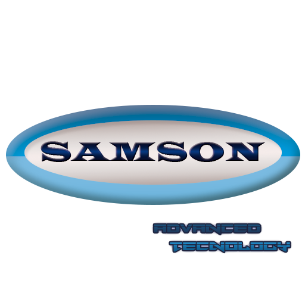

<h1 class="content-subhead">A Propos de nous</h1>

Nous sommes quatre élèves de deuxième année de la filière Eurinsa à l’INSA de Lyon et nous devons réaliser un projet de fin d'année en informatique.

Après avoir réfléchi pendant plusieurs sessions nous avons décidé de créer une applet qui pourrait servir de programme pour un réfrigérateur intelligent. Nous pensons que cela pourrait être un complément idéal pour créer un appareil qui puisse nous aider régulièrement dans notre quotidien.

Les créateurs de cet applet sont :

- Aurélie Gabriel
- Elsa Berthaut
- Fanny Gallais
- Robert Manso Blanco

<h1 class="content-subhead">Le Partenariat</h1>

Samson est leader dans le secteur électronique dans le monde entier. Il est présent dans la production de télévisions, d'ordinateurs, de smartphones... mais aussi et surtout sur le marché des réfrigérateurs.

Pour cette raison, quand l'entreprise a vu qu'un groupe d'étudiants de l'INSA était en train de développer un logiciel pour améliorer les réfrigérateurs, dans le but de simplifier son fonctionnement mais aussi d'augmenter considérablement son potentiel, un représentant de Samson France nous a contacté pour s'informer de notre pensée.

Lors d'une réunion, nous avons exposé nos objectifs et nos attentes avec le fonctionnement que nous voudrions apporter aux frigos. L'entreprise nous a montré son intérêt pour établir une collaboration.

Samson nous a proposé de développer librement notre idée, de nous aider à enregistrer la marque « Superfrigo » (le logotype ci-dessous) et, quand nous aurons fini notre projet en juin, de l'intégrer au développement de ses nouveaux modèles de réfrigérateurs qu'il commencera à produire en 2015.

En exchange, le leader mondial en électronique s'est engagé avec nous à donner 5000€ plus 0,01% sur la vente de chaque frigo.
