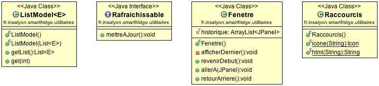

Voici les différents éléments qui ont permis la création de Superfrigo :

<h1 class="content-subhead">Technologie</h1>

### [Apache Maven](https://maven.apache.org/)

Maven est notre outil principal de gestion des dépendances mais il est également utilisé pour créer l'Applet signé.

### [Eclipselink](http://www.eclipse.org/eclipselink/) (Java Persistence API)

Couche de persistence permettant de rendre plus simple les accès base de données (MySQL dans notre cas).

### [Jsoup](http://jsoup.org/)

Bibliothèque permettant de manipuler des pages web depuis du code Java. Permet de retrouver les recettes depuis Internet.

<h1 class="content-subhead">Schemas UML</h1>

### Package `modeles`

La representation objet des elements de la base de données. (Tous les modèles sauf `PropositionRecherche` sont des entités JPA `@Entity`).

### Package `dao`

La couche d'interaction entre la base de données et les objets Java en mémoire. (requêtage, enregistrement, mise à jour, suppressions, ...)

### Package `services`

La couche qui effectue les actions en utilisant les modèles et les DAOs.

### Package `controleurs`

Ils répondent aux évenements déclenchés par l'interface utilisateur (la vue). Ils utilisent les services pour récupérer les données à afficher et utilisent les vues pour effectuer l'affichage de ces données.

### Package `vues`

S'occupent de l'affichage et de l'aspect esthétique de l'application.

### Package `utilitaires`

Outils utilisés par les vues et les contrôleurs pour accélérer et simplifier le développement.

<h1 class="content-subhead">Javadoc</h1>

<a href="javadoc/index.html" class="pure-button">Aller à la Javadoc</a>

<h1 class="content-subhead">Code source</h1>

<a href="https://github.com/eberthaut/superfrigo" class="pure-button">Dernière version disponible sur Github</a>

<a href="https://github.com/eberthaut/superfrigo/tree/gh-pages" class="pure-button">Code source de ce site</a>

