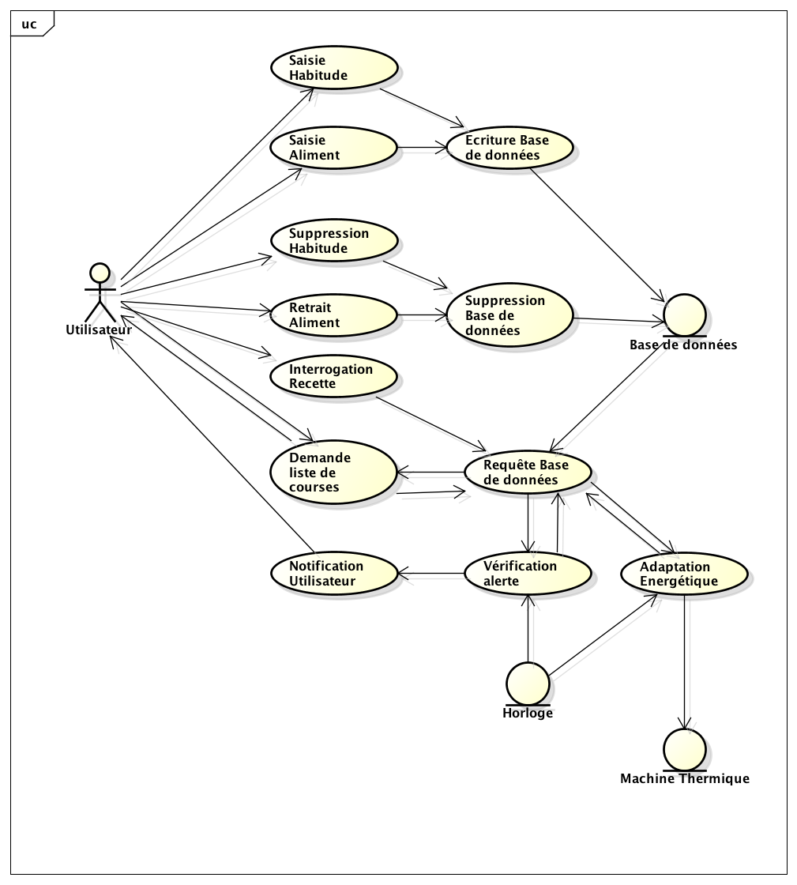

# Cahier des charges

## Introduction

Actuellement, nous vivons dans une société plus adaptée aux nouvelles technologies et dans laquelle nous avons de plus en plus besoin de produits intelligents qui nous facilitent la vie.
C’est pour cette raison que nous avons pensé à créer un programme capable de transformer un frigo courant en un frigo qui nous aide à faire les courses habituelles et à gérer les aliments qu’il contient. Cela nous permettrait de ne pas perdre de temps à vérifier l’état des produits de façon régulière ou à faire une liste de courses chaque semaine.

Pour ce faire, nous avons pensé que le frigo devrait contenir un programme informatique qui aura déjà les informations de la plupart des aliments disponibles en supermarché et ses informations correspondantes (la date de péremption, le type d’aliment, la marque…). De cette façon, au moment de ranger nos courses dans le frigo il ne reste plus qu’à lui indiquer les aliments que l’on introduit, afin qu’il puisse identifier et contrôler automatiquement la qualité du produit et sa date de péremption.

Nous allons donc essayer de créer le programme que devrait contenir notre frigo prototype. Ce frigo sera muni d’un ordinateur encastré dans sa porte ainsi qu’un écran avec lequel nous pourrions interagir de façon pratique et confortable. Pour ce faire, nous utiliserons une interface graphique ayant pour but de faciliter et simplifier la communication avec l’utilisateur.
Nous avons pensé créer un menu principal donnant accès à différents différents boutons nous permettant de réaliser les actions suivantes : ajouter ou retirer des aliments, savoir lesquels sont périmés ou encore faire la liste de courses (//Bouton recette?). Chaque bouton mènera une nouvelle fenêtre où nous pourrons réaliser l’action d’une façon simple et graphiquement compréhensible.
Dans la suite, nous allons expliquer précisément ce qui se passe lorsque l’on appuie sur chaque bouton.

## Interactions et Interface Utilisateur

### Menu Principal

Premièrement, et avant d'appuyer sur aucun des buttons, nous trouverons à l’écran l’image d’un frigo avec trois buttons: ajouter, retirer et liste de courses, en plus d’un “triangle alerte”.
Dans l’image nous pouvons observer que les trois buttons seront placés de façon verticale au centre gauche de l’écran et le triangle au dessous à la droite.

Quelque soit le bouton qu’on touche nous avons décidé de créer un effet sur l’écran de façon à que la porte du frigo montré dans le menu principale glisse vers la droite en montrant tout de suite le menu correspondant

### Dialogue d'alerte

Le triangle de couleur rouge indique qu’il y a un ou plusieurs aliments qui ont périmé. Nous pouvons accéder à la liste des aliments périmés en appuyant sur le bouton.

Le triangle sera de couleur jaune si il y en a qui sont proches de leur date de péremption. En appuyant sur le bouton, nous pourrons alors voir la liste des aliment qui périmera dan x jours (possibilité de choisir la durée). Enfin, le triangle vert si tous les produits sont frais.

### Menu d'ajout

Le bouton d'ajout nous permet d’ajouter des aliments dans notre base de données. En renseignant le nom de l’aliment, on lui donne automatiquement un identifiant ainsi qu’une date d’introduction dans le frigo.    

Dans cette deuxième image nous pouvons observer le menu qui apparaît si nous appuyons sur le bouton ajouter. Cela nous affiche à gauche les différents types d’aliments possibles  et à droite une liste avec tous les produits ainsi que la quantité que l’on vient d’ajouter.

À la droite de cette liste il y a pour chaque produit un bouton + pour ajouter un de même type chaque fois (pour faciliter l’introduction quand nous avons une grand quantité de produits du même type) et un bouton - permettant d’effacer ceux que nous avons introduit par erreur.

En plus, la croix située à gauche du nom d’un produit permet d’effacer toute la quantité d’un produit.

Tout au dessus à droite il y a une barre de recherche qui nous permet trouver les aliments que nous avons ajouté dans nôtre liste facilement.

Finalement, la touche “retour” nous permet retourner au menu principal.

Par exemple, voilà l’image que l’on obtiendrait en cliquant sur “produits laitiers” :

Nous nous retrouvons avec une distribution des boutons similaire à celle de l’image précédente, mais nous remarquons que les articles ont aussi les boutons + et - dans les grands panneaux, permettant d’augmenter ou de diminuer leur quantité en “produits ajoutés”.

Les boutons “flèche gauche” et “flèche droite” permettent de voir tous les “produits laitiers”, car dans ce cas, le type contient plus de six produits et il n’est pas possible de les afficher tous dans le même écran.

### Menu retrait

Il nous permet de supprimer ou changer la quantité de cet élément qui sera ou non périmé.

Dans cette image on retrouve le menu qui apparaît lorsque nous appuyons sur retirer. Il nous affiche les différents produits présents dans notre frigo, rangés selon la date de péremption (De tel façon que si, par exemple il y a une banane périmée et une autre non, elles seront affichés dans un ordre différent).

Nous avons les boutons d’ajouter + et supprimer - comme dans le bouton “ajouter”, en plus des flèches pour voir tous les produits présents dans le frigo. De plus, la croix à gauche de l’aliment permet de supprimer tous les aliments qui sont de même type et qui ont la même date de péremption.

La date de péremption, comme dans le bouton “triangle alerte” du menu principal, est affichée de couleur rouge si l’aliment est périmé, jaune s’il est proche (dans ce cas nous avons posé arbitrairement 6 jours comme limite) et vert s’il est encore loin de la date de péremption.

On retrouve la barre de recherche qui permet de trouver plus facilement un produit si la liste est trop longue. Enfin en haut on précise la date actuelle pour la pouvoir comparer à celle de péremption facilement.

La touche “retour” nous permet de retourner au menu principal.

### Menu liste de course

Il nous permet de nous donner la liste des courses que nous devons faire au jour en fonction de nos habitudes alimentaires, que le frigo aura enregistré précédemment.

Cette image représente l’écran qui nous nous affiche quand nous avons appuyé sur le bouton “liste de courses”. Il nous permet de changer la quantité d’aliments que nous voulons acheté au supermarché.