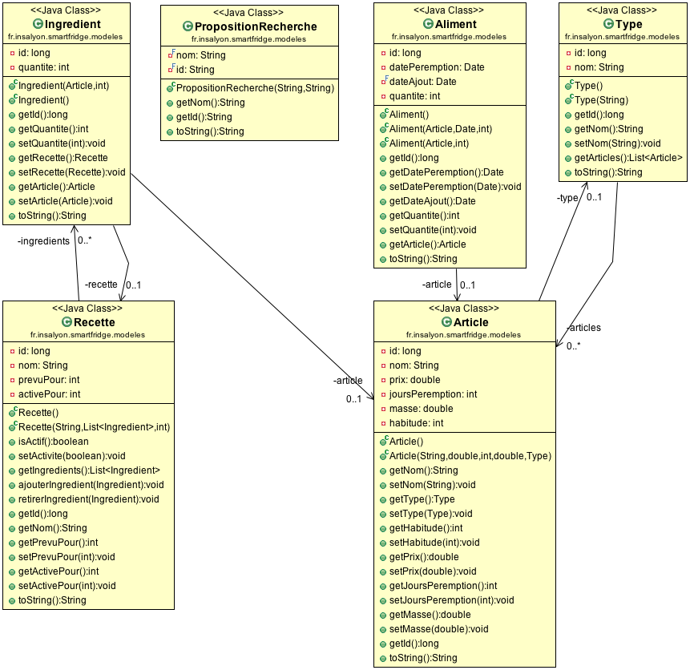
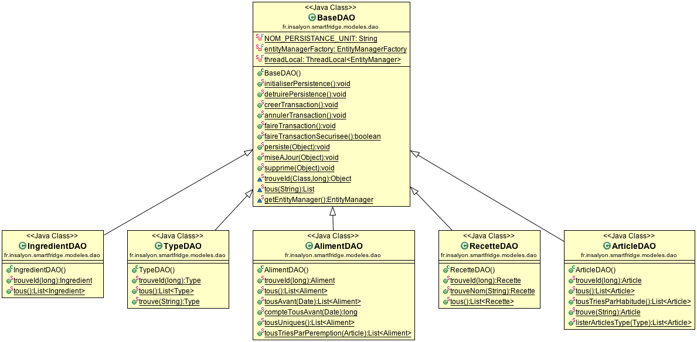
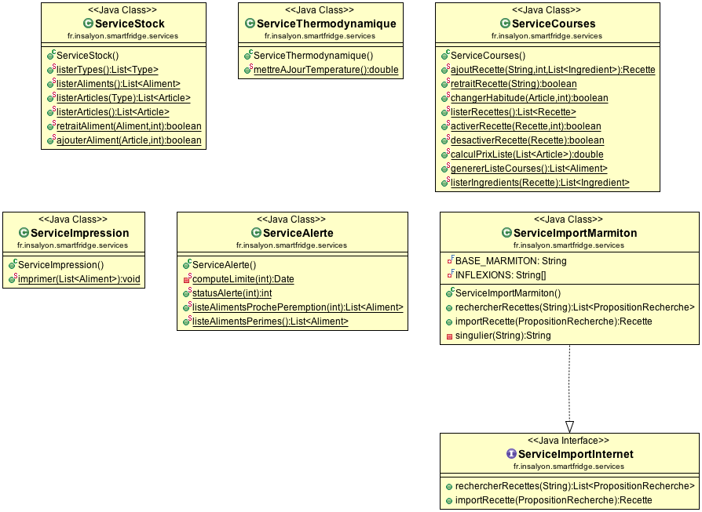
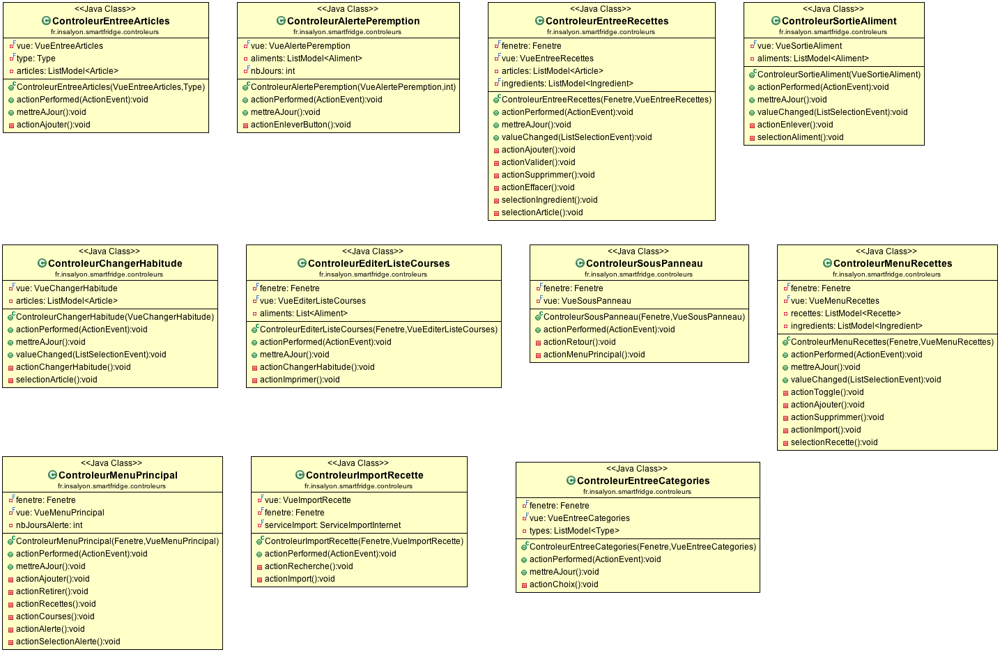
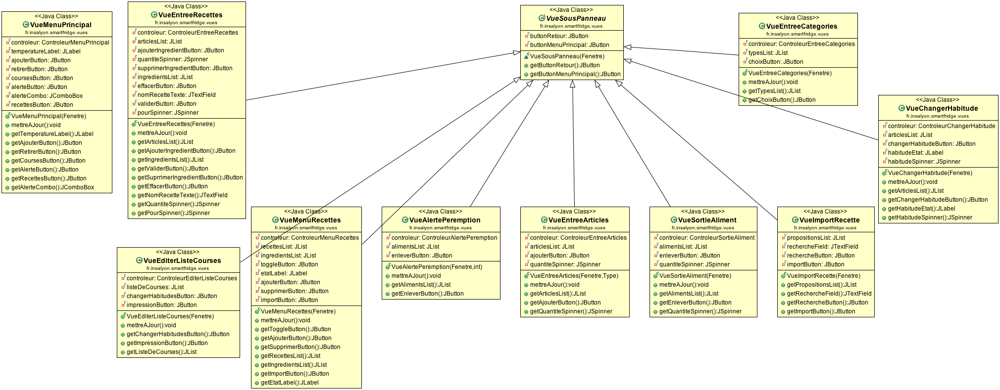
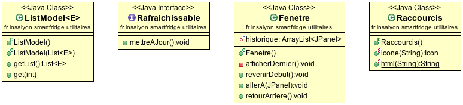

Voici les différents éléments qui ont permis la création de Superfrigo :

<h1 class="content-subhead">Technologie</h1>

### [Apache Maven](https://maven.apache.org/)

Maven est notre outil principal de gestion des dépendances mais il est également utilisé pour créer l'Applet signé.

### [Eclipselink](http://www.eclipse.org/eclipselink/) (Java Persistence API)

Couche de persistence permettant de rendre plus simple les accès base de données (MySQL dans notre cas).

### [Jsoup](http://jsoup.org/)

Bibliothèque permettant de manipuler des pages web depuis du code Java. Permet de retrouver les recettes depuis Internet.

<h1 class="content-subhead">Schemas UML</h1>

### Package `modeles`

### Package `dao`

### Package `services`

### Package `controleurs`

### Package `vues`

### Package `utilitaires`

<h1 class="content-subhead">Javadoc</h1>

<a href="javadoc/index.html" class="pure-button">Aller à la Javadoc</a>

